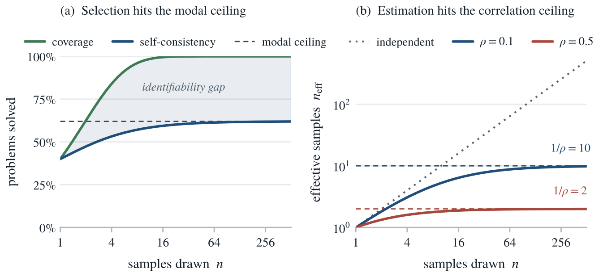

<p align="center">
  <h1 align="center">When More Sampling Hurts</h1>
  <h3 align="center">The Modal Ceiling and Correlation Ceiling of Test-Time Scaling</h3>
  <p align="center">
    <a href="https://arxiv.org/abs/2606.28661"></a>
    <a href="https://opensource.org/licenses/MIT"></a>
    
  </p>
</p>

<p align="center">
  <strong>Yong Yi Bay</strong> &nbsp;&middot;&nbsp; <strong>Kathleen A. Yearick</strong><br>
  University of Illinois at Urbana-Champaign
</p>

---

<p align="center">
  
</p>

<p align="center">
  <em>The two ceilings. Left: selection (self-consistency) saturates at the modal ceiling while coverage keeps climbing, and the wedge between them is the identifiability gap. Right: the effective number of samples <code>n_eff = n/[1+(n-1)&rho;]</code> saturates at the correlation ceiling <code>1/&rho;</code>, so a problem sampled with intraclass correlation <code>&rho;</code> is worth at most <code>1/&rho;</code> independent draws, however large the budget.</em>
</p>

**Test-time scaling draws many samples from one model** and reports performance against the sample count `n`, accounting for the draws as if they were independent. They are not: samples from one model at a fixed temperature share a prompt, a decoding distribution, and recurring reasoning templates, so they are positively correlated. This note makes that precise with one borrowed instrument and turns the right stopping point into a single number any sampling run already reveals.

**Key idea: test-time sampling is cluster sampling.** A problem is a cluster and its `n` attempts are correlated draws within it, so every same-problem quantity inherits the survey-sampling *design effect* `d_eff = 1 + (n-1)ρ`, where `ρ` is the intraclass correlation of the per-attempt success indicators. The usable count is therefore not `n` but the **effective number of samples**

```
n_eff = n / [ 1 + (n-1) ρ ]   →   1/ρ   as n → ∞.
```

The limit `1/ρ` is a hard **correlation ceiling**: beyond about `1/ρ` samples, extra draws are statistically redundant. The bottleneck is recognizing a right answer, not generating one.

## How it works

One nominal sample count buys different amounts of three different things, and each meets a different ceiling.

| What `n` buys | What it reads | Within-problem ceiling | Past the ceiling |
| --- | --- | --- | --- |
| **Estimating** a benchmark mean | a sample mean | correlation ceiling `1/ρ_b` (about two effective draws on released logs) | redundant; evaluation should buy more problems, not more samples |
| **Selecting** an answer (self-consistency, best-of-`n`) | the *mode* of the answer distribution | **modal-hit rate** `π_mode`, the fraction of problems whose most common answer is correct | plateaus; where the mode is wrong it *anti-scales*, sharpening a confident error as coverage rises |
| **Covering** (one correct sample for a verifier) | a max over draws | none | keeps paying |

So the widely reported gap, in which coverage scales over orders of magnitude while majority voting and reward models plateau beyond a few hundred samples, is two ceilings pulling apart: an identifiability limit, not the design effect. The difficulty-heterogeneity power law for coverage is the within-problem `ρ_w = 0` case.

## What the released logs show

Both correlations are measured on public logs, not assumed.

- **Between-problem spread** `ρ_b ≈ 0.4–0.6`, from the independent-draw logs of Brown et al. (*Large Language Monkeys*). Ten thousand samples per problem then carry the benchmark-mean information of about two.
- **Within-problem ceiling**, read off a dependent-draw log (the best-of-`n` release of Beeching, Tunstall, and Rush): 500 MATH-500 problems sampled 256 times each by one model at a fixed temperature. One session's answers collapse onto a median of ~13 modes, coverage reaches 0.88, and self-consistency plateaus at 0.45.
- **The two-stage identity** `ρ = ρ_b + (1 − ρ_b)ρ_w` holds on real data to within 0.001: `0.401` pooled versus `0.402` from the separate terms.

## Build

```
make verify    # numerically check every proposition against Monte Carlo (uv)
make figures   # regenerate every figure (model-based + empirical) from cached summaries (uv + matplotlib, fixed seeds)
make data      # re-download and re-grade the public logs (uv sync --extra data); optional, cached JSON is committed
make all       # figures + compile paper/main.pdf (tectonic or latexmk)
make arxiv     # assemble the self-contained arXiv source under build/arxiv-source
```

The Python environment is pinned in `pyproject.toml` and installed with `uv sync` (add `--extra data` to regenerate the empirical summaries). Simulations use fixed seeds, and the graded per-problem counts are cached as committed JSON, so figures and checks are bit-for-bit reproducible without re-downloading the multi-hundred-MB logs.

## Repository structure

```
Makefile                 Build targets: verify, figures, data, all, arxiv.
pyproject.toml           uv-managed dependencies (pinned in uv.lock).
CITATION.cff             Citation metadata.

paper/
  main.tex               Paper source (LaTeX).
  main.pdf               Compiled paper.
  main.bbl               Pre-built bibliography (shipped for arXiv).
  references.bib         Bibliography source.
  figures/               Publication figures (PDF; two_ceilings also as PNG for this README).
  data/                  Cached, graded per-problem summaries (committed JSON).
  LICENSE                CC BY 4.0 (paper text and figures).

scripts/
  make_figures.py        Generates every figure from the model and the cached summaries.
  verify_math.py         Numerical verification of the propositions against Monte Carlo.
  analyze_brown.py       Estimates between-problem ρ_b (clustered-bootstrap CI) on the Brown et al. logs.
  analyze_rhow.py        Measures within-problem ρ_w and the within-session gap on the Beeching et al. best-of-n log.
```

## Reusing the result

Report the effective number of samples alongside the nominal count:

> Following Bay and Yearick, we report the effective number of samples
> `n_eff = n/[1+(n-1)ρ]` alongside the nominal sample count.

## Citation

Paper: [arXiv:2606.28661](https://arxiv.org/abs/2606.28661) · DOI: [10.48550/arXiv.2606.28661](https://doi.org/10.48550/arXiv.2606.28661)

```bibtex
@article{bay2026ceilings,
  title         = {When More Sampling Hurts: The Modal Ceiling and Correlation Ceiling of Test-Time Scaling},
  author        = {Bay, Yong Yi and Yearick, Kathleen A.},
  year          = {2026},
  eprint        = {2606.28661},
  archivePrefix = {arXiv},
  primaryClass  = {cs.LG},
  doi           = {10.48550/arXiv.2606.28661}
}
```

## License

The source code (`scripts/`, `Makefile`) is released under the MIT License
([LICENSE](LICENSE)). The paper text and figures (`paper/`) are licensed under
CC BY 4.0 ([paper/LICENSE](paper/LICENSE)).
